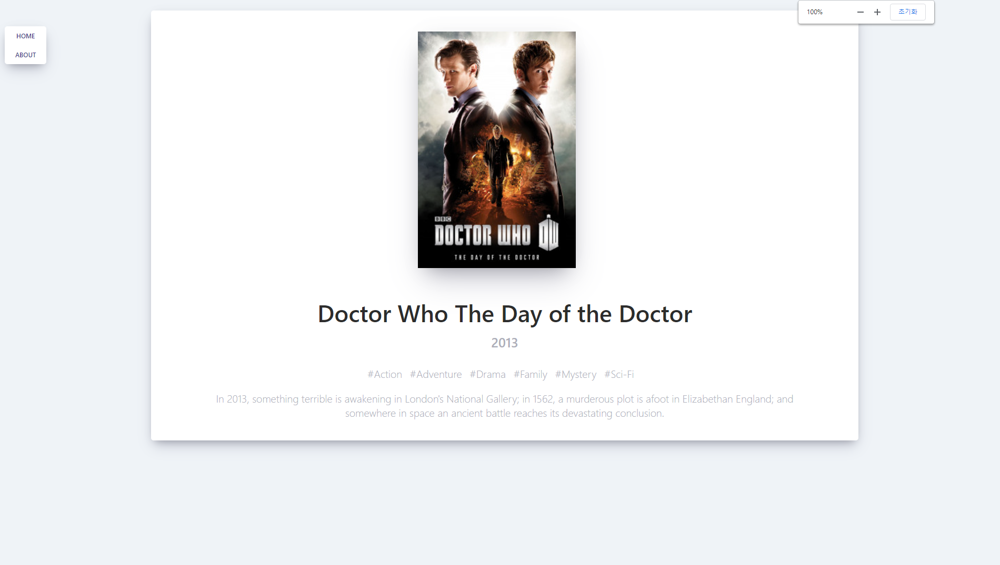

<div align="center">
  <br />
  
  <br />
  <h1>영화 정보 웹 서비스 (Movie Information Web Service)</h1>
  <a href="https://jeonghwan-dev.github.io/movie-web-service">
  
  </a>
  <br />
</div>

## 목차

1. **웹 서비스 소개**
2. **기술 스택**
3. **주요 기능**
4. **주요 페이지**
5. **실행 방법**

<br />

## 💁🏻‍♂ 웹 서비스 소개

&nbsp;&nbsp;'YTS.mx' 사이트에서 제공하는 `영화 정보 오픈 API`를 사용하여 사용자에게 **영화 정보를 제공**하는 웹 서비스입니다.

- **'YTS.mx' 사이트 주소**
  > https://yts.mx/
- **사용 오픈 API**
  > https://yts-proxy.now.sh/list_movies.json?sort_by=rating

<br />

[**🔗 배포된 웹 서비스로 바로가기 Click !**](https://jeonghwan-dev.github.io/movie-web-service) 👈  
> 새 창 열기 방법 : CTRL+click (on Windows and Linux) | CMD+click (on MacOS)
<br />

## 🛠 기술 스택

**Front-end**

-   
- 

**ETC**

-  

<br />

## 💡 주요 기능

- 영화 정보(개봉 연도, 해시태그, 줄거리) 제공

<br />

## 📄 주요 페이지

|                             메인 페이지                             |                           자세히 보기 페이지                            |
| :-----------------------------------------------------------------: | :---------------------------------------------------------------------: |
|  |  |

<br />

## 💻 실행 방법

1. **원격 저장소 복제**

```bash
$ git clone https://github.com/JeongHwan-dev/movie-web-service.git
```

2. **필요한 node_modules 설치** (복제한 저장소 위치에서)

```bash
$ npm install
```

3. **리액트 앱 실행**

```bash
$ npm start
```
